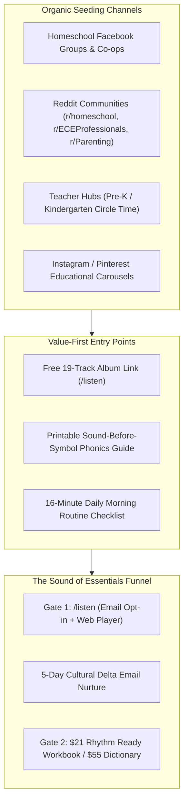

# 🌿 SOE Organic Community Seeding & Distribution Playbook
**The Sound of Essentials: Rhythm Quest · Zero-Ad-Spend Distribution Engine**

> **Goal:** Drive organic, high-trust traffic to the `/listen` gate ($0 free 19-track album) through value-first community participation, discussion starters, and teacher/parent resource sharing.
> **Core Principle:** Never post "sales pitches." Post authentic founder/educator vulnerability, free educational value, and sensory-friendly solutions to real parent frustrations.

---

## 1. Distribution Channel Matrix

---

## 2. Homeschool Facebook Groups & Co-op Communities

**Target Groups:** *Wild + Free Families*, *Charlotte Mason Living Books & Music*, *Classical Education at Home*, *Montessori Early Years (Ages 2-7)*, *Screen-Free Parenting Sanctuary*.

---

### Post #1: The "Music Program Cut" Origin Story (High Emotion & Resonance)
* **Visual:** Warm photo of the printed workbook on a morning wood table with headphones (`SOE_on_table.jpeg`) or Seriphia with the storybook.
* **Tone:** Vulnerable, authentic, parent-to-parent.

**Copy:**
> To the parents trying to build a peaceful morning routine:
>
> A while back, I watched my children's school cut their music and arts program. Not because the kids didn't love it, and not because it wasn't working. But simply because music wasn't on the standardized testing grid.
>
> It broke my heart. Music isn't an elective for a 4-year-old—it's the neurological foundation of how their brain learns to count, hear phonics, and calm down.
>
> So, guided by a father's heart and a mother's love, we spent months building what the schools took away. I created **The Sound of Essentials: Rhythm Quest**—19 original songs covering phonics, math, science, movement, and emotional regulation across 7 imaginary lands.
>
> We just made the entire 19-track album completely free for homeschool families (instant access, no paid trial required). If you need something calming and educational for circle time or car rides:
>
> 👉 You can stream and download all 19 tracks here: `thesoundofessentials.com/listen`
>
> Hope it brings a little peace and joy to your mornings! 💛

---

### Post #2: The Sound-Before-Symbol Phonics Hack (Educational Authority)
* **Visual:** Kenji & Aiko in Harmonia (`Pond Aiko_Kenji.png`).
* **Tone:** Actionable teaching tip + free resource.

**Copy:**
> Quick phonics tip for parents with 3 to 6-year-olds struggling with letter worksheets:
>
> If your child resists tracing letters or gets frustrated with flashcards, try shifting from **Symbol-First** to **Sound-First**.
>
> In early cognitive development, the ear decodes rhythm and syllables months before the eye can comfortably track abstract 2D letter shapes. When children internalize the *pulse* of a beginning sound (/b/ - /b/ - Butterfly with two claps), decoding becomes second nature.
>
> In our homeschool music series (*Rhythm Quest*), we teach the entire early alphabet through rhythmic call-and-response echo songs.
>
> We put together 19 free tracks + printable coloring activity pages for parents who want a calm, screen-free way to practice phonics during breakfast or quiet time:
>
> 👉 Free access: `thesoundofessentials.com/listen`
>
> What are your favorite movement games for teaching beginning letter sounds?

---

### Post #3: The Screen-Free Car Ride Alternative (Pain Relief)
* **Visual:** Children singing in Harmonia (`Dance Harmonia Vitalis.png`).
* **Tone:** Relief, practical everyday routine.

**Copy:**
> Anyone else tired of the car ride screen dilemma?
>
> We wanted something that wasn't hyperactive cartoon noise, but still kept our kids (ages 3 & 6) completely engaged without melting down when we arrived at our destination.
>
> We created an album of 19 acoustic, story-driven learning songs that teach real vocabulary, counting, French words, and animal science through rhythm.
>
> Track 1 (*Hello, 7 Lands!*) and Track 5 (*Le Cheval*) are instant favorites in our house.
>
> You can listen to the entire album free here: `thesoundofessentials.com/listen`
>
> Zero ads, zero subscriptions—just honest learning music for little ears. 🎵

---

## 3. Reddit Community Threads

---

### Thread 1: `r/homeschool` — "How we replaced 4-hour morning overwhelm with a 16-minute rhythm"

**Title:** *Why we stopped fighting over morning worksheets (and replaced them with a 16-minute rhythm)*

**Post Body:**
> When we first started early homeschool (Pre-K / K), I made the mistake of trying to replicate an elementary school desk schedule. Flashcards, writing drills, and timers. It led to daily tears and burnout for both of us.
>
> What changed everything was shifting to a **micro-block rhythmic routine**:
>
> 1. **Word Detectives (3 min):** Sing a quick phonetic echo track.
> 2. **Number Hunt (3 min):** Rhythmic counting claps (1–20).
> 3. **Garden Secrets (3 min):** Nature observation / weather question.
> 4. **Wake-Up Movement (3 min):** Somatic stretches with music.
> 5. **Evening Reflection (2 min):** What was your favorite moment today?
>
> Total time: 16 minutes. Because it's anchored to music, our kids actually look forward to it, and their phonetic retention jumped significantly compared to silent tracing sheets.
>
> I built a free 19-track learning album based on this exact framework (`thesoundofessentials.com/listen`) if anyone wants to test a music-first approach in their morning routine.
>
> How do you structure your early morning blocks to keep things peaceful?

---

### Thread 2: `r/ECEProfessionals` — "Low-stimulation music resources for circle time (Pre-K / Kindergarten)"

**Title:** *Free acoustic & sensory-friendly circle time album (Phonics, Counting, Movement)*

**Post Body:**
> Hi fellow early childhood educators,
>
> Finding classroom music that isn't overstimulating, hyper-synthesized, or commercially grating is an uphill battle.
>
> We developed **The Sound of Essentials: Rhythm Quest**—a collection of 19 acoustic songs specifically paced for developing nervous systems (warm brass, piano, orchestral strings, natural percussion).
>
> Each track maps directly to an early developmental domain:
> - **Harmonia:** Beginning phonics & polite manners
> - **Numeria:** 1–20 rhythmic counting & shapes
> - **Vitalis:** Cross-body motor coordination & gentle stretching
> - **Aquaria:** Calming breathing exercises & emotional vocabulary
> - **Luminosity:** Bilingual French & curiosity
>
> It’s 100% free to stream for classrooms: `thesoundofessentials.com/listen`
>
> No logins or paywalls. Feel free to use it in your classrooms or share it with families who ask for low-screen alternatives at home!

---

## 4. Pinterest & Instagram Educational Carousels

### Carousel 1: "The 5 Signs of Screen Fatigue in Early Learners (And the Acoustic Antidote)"
* **Slide 1 (Hook):** 5 Signs of Screen Overstimulation in Kids (And the simple 3-minute sensory reset).
* **Slide 2:** Sign 1: Glazed visual fixation vs. active auditory listening.
* **Slide 3:** Sign 2: Immediate emotional dysregulation when the device powers down.
* **Slide 4:** The Antidote: Acoustic rhythm grounds the nervous system while building verbal vocabulary.
* **Slide 5:** Meet the 7 Lands of Rhythm Quest.
* **Slide 6 (CTA):** Download the Free 19-Track Album + Coloring Pages at `thesoundofessentials.com/listen`.

### Carousel 2: "Why Spelling Starts in the Ear, Not the Hand"
* **Slide 1 (Hook):** Why tracing letters won't fix early reading struggles (Do this instead).
* **Slide 2:** The brain's phonological loop: Ear → Echo → Symbol.
* **Slide 3:** How Kenji & Aiko play the Rhythm Echo Game in Harmonia.
* **Slide 4:** 3 simple clapping games you can do at breakfast.
* **Slide 5 (CTA):** Get the complete 19-track phonics & math curriculum album free at `thesoundofessentials.com/listen`.

---

## 5. Daily Community Seeding Workflow

| Day | Action | Channel | Expected Outcome |
|---|---|---|---|
| **Monday** | Post Origin Story / Classroom Injustice angle | 2 Homeschool FB Groups | 25–40 new `/listen` leads |
| **Tuesday** | Share Circle Time Music resource | `r/ECEProfessionals` / `r/homeschool` | 15–30 educator downloads |
| **Wednesday** | Publish "5 Signs of Screen Fatigue" Carousel | Instagram & Pinterest | Evergreen saves & shares |
| **Thursday** | Comment value-first responses on 5 active Reddit parenting threads asking for "low-stimulation toddler music" | `r/Parenting`, `r/toddlers` | 10–20 high-intent visitors |
| **Friday** | Share Free Coloring Book sheet & song link | Local homeschool co-op email list / Telegram | 20+ viral word-of-mouth shares |
